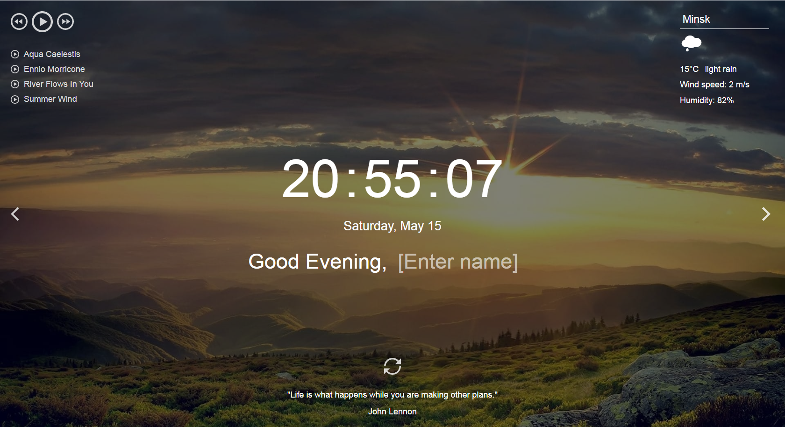

# momentum

**Momentum** - аналог [одноимённого приложения](https://chrome.google.com/webstore/detail/momentum/laookkfknpbbblfpciffpaejjkokdgca?hl=ru) интернет-магазина Chrome. Приложение показывает время и имя пользователя. Фоновое изображение и приветствие меняются в зависимости от времени суток.
В приложении есть часы, слайдер изображений, виджеты погоды, аудиоплеер, блок цитата дня, настройки. Для хранения имени пользователя и населённого пункта используется локальное хранилище - local storage.

#### Ключевые навыки:
- методы поиска элементов;
- вывод данных на страницу;
- работа с датой и временем;
- работа с аудио;
- сохранение данных в local storage;
- использование рекурсивного setTimeout;
- деление js-кода на модули;
- работа с асинхронными запросами.

## Функционал приложения
1. Часы и календарь
   - время выводится в 24-часовом формате, например: `21:01:00`
   - время обновляется каждую секунду - часы идут. Когда меняется одна из цифр, остальные при этом не меняют своё положение на странице (время не дёргается)
   - выводится день недели, число, месяц, например: "Воскресенье, 16 мая" / "Sunday, May 16"
   Язык и формат вывода даты определяется языком приложения.
   - при изменении дня недели, даты, месяца эти данные меняются в приложении.
2. Приветствие
   - текст приветствия меняется в зависимости от времени суток (утро, день, вечер, ночь)
      - с 6:00 до 11:59 - Good morning / Доброе утро
      - с 12:00 до 17:59 - Good afternoon / Добрый день
      - с 18:00 до 23:59 - Good evening / Добрый вечер
      - с 00:00 до 5:59 - Good night / Доброй/Спокойной ночи
   - при изменении времени суток, если в это время приложение открыто, меняется текст приветствия
   - пользователь может ввести своё имя. При перезагрузке страницы приложения имя пользователя сохраняется, данные о  нём хранятся в local storage
3. Смена фонового изображения
   - ссылка на фоновое изображение формируется с учётом времени суток и случайного номера изображения (от `01` до `20`)
   Пример ссылки на фоновое изображение: `https://raw.githubusercontent.com/rolling-scopes-school/stage1-tasks/assets/images/evening/18.jpg`, здесь
      - `evening` - время суток, другие значения `afternoon`, `morning`, `night`
      - `18` - рандомный (случайный) номер изображения, от `01` до `20`.
   - изображения можно перелистывать кликами по стрелкам, расположенным по бокам экрана.
   - изображения перелистываются последовательно - после 18 изображения идёт 19 (клик по правой стрелке), перед 18 изображением идёт 17 (клик по левой стрелке)
   - изображения перелистываются по кругу: после двадцатого изображения идёт первое (клик по правой стрелке), перед 1 изображением идёт 20 (клик по левой стрелке)
   - при смене слайдов важно обеспечить плавную смену фоновых изображений. Не должно быть состояний, когда пользователь видит частично загрузившееся изображение или страницу без фонового изображения. Плавную смену фоновых изображений не проверяем: 1) при загрузке и перезагрузке страницы 2) при открытой консоли браузера 3) при слишком частых кликах по стрелкам для смены изображения
4. Виджет погоды
   - город по умолчанию - Варшава, пока пользователь не ввёл другой город
   - при перезагрузке страницы приложения указанный пользователем город сохраняется, данные о  нём хранятся в local storage
   - для указанного пользователем населённого пункта выводятся данные о погоде, если их возвращает API
   - данные о погоде включают в себя: иконку погоды, описание погоды, температуру в `°C`, скорость ветра в `м/с`, относительную влажность воздуха в `%`. Числовые параметры погоды округляются до целых чисел
   - выводится уведомление об ошибке при вводе некорректных значений, для которых API не возвращает погоду (пустая строка или бессмысленный набор символов)
5. Виджет цитата дня
   - при загрузке страницы приложения отображается рандомная цитата и её автор
   В качестве источника цитаты можно использовать как API, так и созданный или найденный в интернете JSON-файл с цитатами и их авторами.
   - при перезагрузке страницы цитата обновляется (заменяется на другую). Есть кнопка, при клике по которой цитата обновляется (заменяется на другую)
6. Аудиоплеер
   - при клике по кнопке `Play/Pause` проигрывается первый трек из блока `play-list`, иконка кнопки меняется на `Pause`
   - при клике по кнопке `Play/Pause` во время проигрывания трека, останавливается проигрывание трека, иконка кнопки меняется на `Play`
   - треки можно пролистывать кнопками `Play-next` и `Play-prev`
   - треки пролистываются по кругу - после последнего идёт первый (клик по кнопке `Play-next`), перед первым - последний (клик по кнопке `Play-prev`)
   - трек, который в данный момент проигрывается, в блоке `Play-list` выделяется стилем
   - после окончания проигрывания первого трека, автоматически запускается проигрывание следующего. Треки проигрываются по кругу: после последнего снова проигрывается первый.
   Для удобства проверки треки возьмите небольшой продолжительности. Обрезать треки можно здесь: `https://mp3cut.net/ru/`
   - плейлист генерируется средствами JavaScript
7. Дополнительный функционал на выбор
   Достаточно выполнить только один из предложенных пунктов на ваш выбор.
   - ToDo List - список дел (как в оригинальном приложении)
   - список ссылок (как в оригинальном приложении)
   - свой собственный дополнительный функционал, по сложности аналогичный предложенным

#### Требования к оформлению приложения
- внешний вид приложения соответствует предложенному образцу или является его улучшенной версией
- вёрстка адаптивная. Минимальная ширина страницы, при которой проверяется корректность отображения приложения - 320рх, максимальная ширина страницы, при которой проверяется корректность отображения приложения - 1920рх
- интерактивность элементов, с которыми пользователи могут взаимодействовать, изменение внешнего вида самого элемента и состояния курсора при наведении, использование разных стилей для активного и неактивного состояния элемента, плавные анимации

## API с цитатами
- https://favqs.com/api/qotd
- https://type.fit/api/quotes
- https://api.chucknorris.io/jokes/random
- https://www.breakingbadapi.com/api/quotes